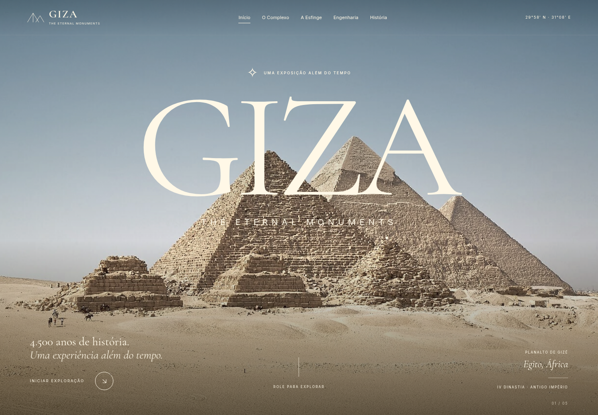
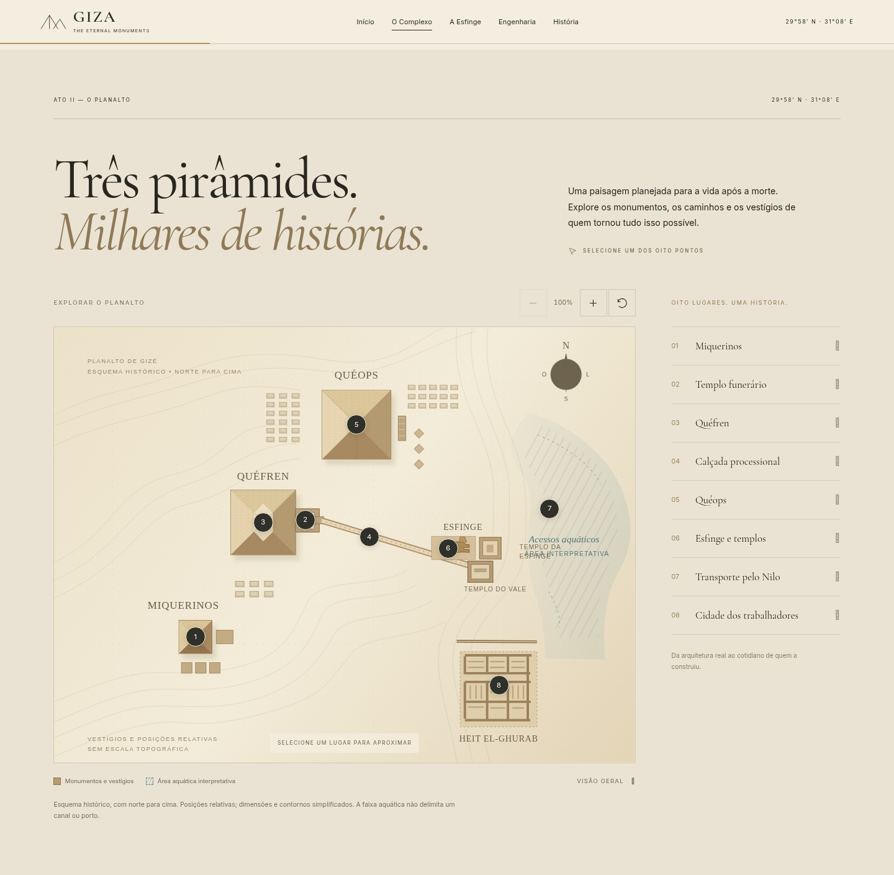
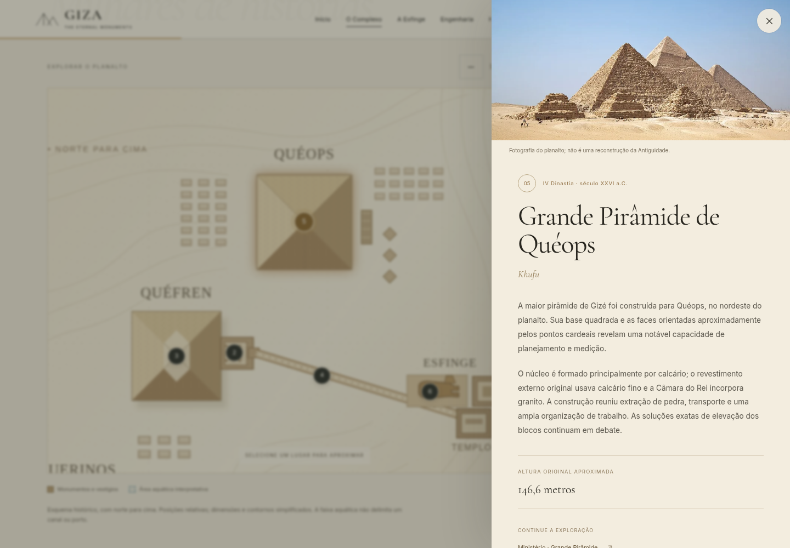
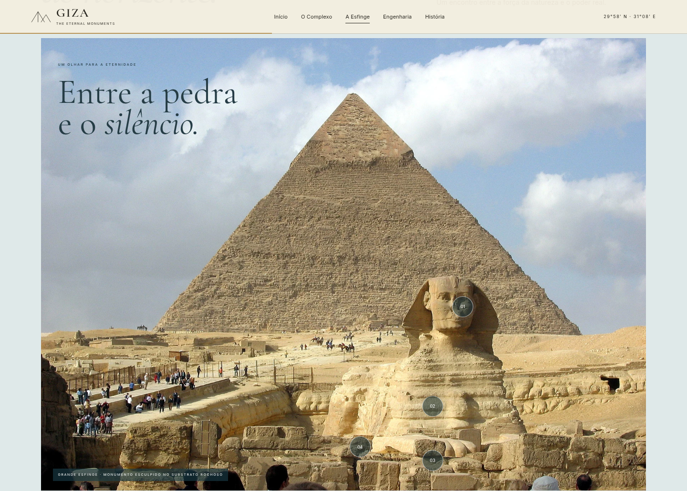
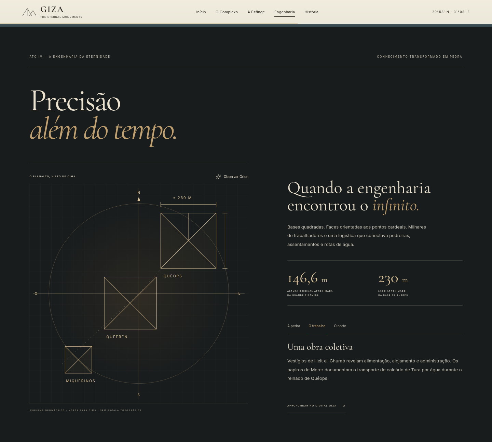
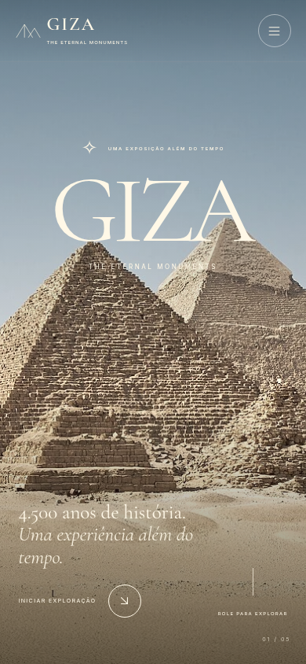

# GIZA: THE ETERNAL MONUMENTS

**4.500 anos de história. Uma experiência além do tempo.**

Uma exposição digital em português brasileiro dedicada às pirâmides, à Grande Esfinge e às pessoas que transformaram o planalto de Gizé. Fotografia documental, cartografia interativa e narrativa por rolagem conectam cinco atos: deserto, planalto, guardiã, engenharia e legado.

## Amostra do sistema

Capturas reais do site em execução no navegador, mostrando a apresentação, a exploração interativa e a versão para celular. As imagens podem ser abertas para visualizar os detalhes.

### Abertura da exposição

Fotografia das pirâmides, navegação e acesso à exploração do complexo.



### Mapa interativo do planalto

Oito lugares para explorar, com marcadores, lista de monumentos e controles de zoom.



### Exploração em ação

Ao selecionar Quéops no mapa, o sistema abre um painel com fotografia, informações históricas e dados do monumento.



### A Grande Esfinge

Fotografia com quatro pontos de interesse para explorar a cabeça, o corpo, as patas e a Estela do Sonho.



### Engenharia e construção

Diagrama das pirâmides e conteúdo da aba **O trabalho**, selecionada durante a captura.



### Versão para celular

Abertura adaptada à tela menor, com menu móvel e botão de exploração.



Fotografias presentes nas capturas: Ricardo Liberato — [CC BY-SA 2.0](https://creativecommons.org/licenses/by-sa/2.0/) — e Hamish2k — [CC BY-SA 3.0](https://creativecommons.org/licenses/by-sa/3.0/). Consulte os [créditos, origens e condições de uso](docs/media-licenses.md#capturas-do-sistema).

## Funcionalidades

- Hero fotográfico com tipografia editorial, zoom cinematográfico e transição por rolagem.
- Mapa SVG orientado ao norte, oito marcadores, lista acessível, câmera, zoom, restauração e arraste no desktop.
- Painéis históricos com fontes, fechamento por Escape e restauração de foco.
- Esfinge com fotografia em parallax, quatro pontos de interesse e informações sobre origem, estrutura, simbolismo e conservação.
- Diagramas de engenharia, abas de materiais/logística/orientação e comparação artística opcional com Órion, explicitamente identificada como hipótese contestada.
- Linha do tempo da IV Dinastia à pesquisa contemporânea.
- Navegação responsiva, indicação da seção atual, progresso de leitura, créditos e fontes.
- Modo de movimento reduzido com todo o conteúdo e as interações disponíveis; fallbacks para GSAP e mídias indisponíveis.

## Executar

Requisitos de desenvolvimento: Node.js 20 ou superior, npm e Python 3. No ambiente preparado foram usados Node.js 24.19.0, npm 11.9.0, Python 3.12.14 e Chromium 151.

```bash
npm ci
npm run dev
```

O servidor HTTP usa a porta **4173**. Os arquivos de fontes e bibliotecas já estão incluídos no projeto; para apenas visualizar o site é suficiente executar `python3 -m http.server 4173` na raiz, sem instalar Node.

**Não abra o `index.html` por `file://`.** Módulos JavaScript e o carregamento do SVG precisam de um servidor HTTP. A instalação reproduz as bibliotecas locais a partir das versões fixadas no lockfile.

## Publicação no GitHub Pages

A estratégia deste repositório é publicar os arquivos estáticos da **branch `main`, pasta `/(root)`**. O `index.html` e seus recursos já estão na raiz; o arquivo `.nojekyll` mantém a publicação estática, sem processamento pelo Jekyll. Não há um workflow de build concorrente.

Nas [configurações do GitHub Pages](https://github.com/Helio965/GIZA-The-Eternal-Monuments/settings/pages), selecione:

1. **Source:** `Deploy from a branch`.
2. **Branch:** `main`.
3. **Folder:** `/(root)`.
4. Clique em **Save** e acompanhe a publicação na aba **Actions**.

Endereço previsto, após a ativação e conclusão da publicação: **https://helio965.github.io/GIZA-The-Eternal-Monuments/**.

A `main` contém o projeto completo e a galeria de capturas. A ativação do Pages ainda está pendente: a API confirmou `has_pages: false` e recusou a criação do site com **HTTP 403 — `Resource not accessible by integration`**. A credencial da integração não tem permissão para habilitar Pages. O endereço previsto respondeu com a página 404 “Site not found” do GitHub Pages. Para publicar, habilite a configuração acima usando sua conta no GitHub. Consulte o [registro da integração, preparação e validação](docs/publication.md).

### Build para outros servidores estáticos

```bash
npm run build
```

O build continua disponível para outros servidores estáticos: publique **o conteúdo de `dist/`**, incluindo os documentos de créditos. Não existe backend nem configuração secreta. Os caminhos são relativos e compatíveis com subdiretórios. O GitHub Pages deste repositório usa a raiz da `main`, sem depender de versionar `dist/`. Criar o build não publica o site automaticamente.

## Testes

```bash
npm test
```

Playwright verifica desktop, celular e movimento reduzido: mídias locais, oito seleções pelo mapa e oito pela lista, conteúdo dos painéis, teclado/foco, zoom/reset, hotspots, abas, Órion, navegação, créditos e ausência de overflow. A configuração usa Chromium instalado em `/usr/bin/chromium` e inicia o servidor caso necessário. Em outro sistema, ajuste `executablePath` no arquivo de configuração ou instale um navegador compatível com Playwright. Capturas e relatórios ficam em `test-results/` e `playwright-report/`, ignorados pelo Git.

## Tecnologias e organização

HTML5, CSS3, JavaScript ES6+, SVG, GSAP 3.13.0, ScrollTrigger e Lucide 0.468.0. Fontes locais Cormorant Garamond e Inter. Nenhuma dependência de CDN, ferramenta paga, Canvas ou WebGL.

```text
index.html
assets/             fotografias WebP, fontes, SVG e bibliotecas locais
css/                estilos, cartografia e adaptações responsivas
js/                 inicialização, movimento, mapa e dados históricos
scripts/            preparação de bibliotecas e build estático
tests/              testes funcionais Playwright
docs/               fontes históricas, referências visuais e licenças
```

## Histórico e direitos de uso

O mapa preserva a disposição relativa nordeste–sudoeste das pirâmides, identifica a calçada e o templo funerário de Quéfren e distingue a Esfinge dos templos próximos. A representação aquática é interpretativa; não afirma posições exatas de canais ou portos. Dimensões e cronologias são aproximadas; métodos de construção e correlação com Órion não são apresentados como certezas.

Consulte [fontes históricas](docs/historical-sources.md), [referências visuais](docs/visual-references.md), [créditos de mídia](docs/media-licenses.md) e [notas de implementação](docs/implementation-notes.md).

Código e SVG próprios: licença MIT existente do repositório. Fotografias: Ricardo Liberato, CC BY-SA 2.0; Hamish2k, CC BY-SA 3.0. Fontes: SIL OFL. Lucide: ISC/Feather MIT. GSAP: Standard License. As fotografias adaptadas conservam as respectivas licenças; não se tornam MIT. Créditos e links de licença são acessíveis no rodapé.

## Limitações reais

- A fotografia de abertura mostra céu azul, com tratamento de cor, em vez do pôr do sol solicitado. Tem 1280 × 851; uma versão licenciada maior melhoraria telas ultrawide. A fotografia da Esfinge tem versão de 1700 × 1275.
- O esquema é didático, sem precisão topográfica certificada. Uma versão georreferenciada exige levantamento documentado e conferência de todas as fases arqueológicas.
- Os sites institucionais e o Wikimedia foram bloqueados pelo proxy nesta sessão. O conteúdo educativo do Digital Giza foi consultado em seu repositório público; as licenças fotográficas foram conferidas nos metadados dos espelhos. Consulta direta das demais fontes e confirmação no Commons continuam pendentes.
- Validação automatizada em Chromium não substitui testes em aparelhos Android/iPhone físicos ou Safari. Não há garantia universal de 60 fps.
- O vídeo enviado orientou a direção de arte e não foi redistribuído. Não foi criado um vídeo novo nem um recorte transparente da Esfinge; a fotografia completa é a composição alternativa.

Melhorias futuras: fotografia panorâmica maior sob luz de pôr do sol, cartografia georreferenciada com fonte e escala, mais imagens documentais licenciadas, validação Safari/Firefox e revisão histórica integral quando as fontes estiverem acessíveis.
